# Lobe Chat API 前后端交互逻辑

本文档说明了 Mr.🆖 AI API 在前后端交互中的实现逻辑，包括事件序列和涉及的核心组件。

## 交互时序图

```mermaid
sequenceDiagram
    participant Client as 前端客户端
    participant ChatService as 前端 ChatService
    participant ChatAPI as 后端 Chat API
    participant AgentRuntime as AgentRuntime
    participant ModelProvider as 模型提供商 API
    participant PluginGateway as 插件网关

    Client->>ChatService: 调用 createAssistantMessage
    Note over ChatService: 处理消息、工具和参数

    ChatService->>ChatService: 调用 getChatCompletion
    Note over ChatService: 准备请求参数

    ChatService->>ChatAPI: 发送 POST 请求到 /webapi/chat/[provider]

    ChatAPI->>AgentRuntime: 初始化 AgentRuntime
    Note over AgentRuntime: 通过 provider 和 用户配置创建运行时

    ChatAPI->>AgentRuntime: 调用 chat 方法
    AgentRuntime->>ModelProvider: 发送 chat completion 请求

    ModelProvider-->>AgentRuntime: 返回流式响应
    AgentRuntime-->>ChatAPI: 处理响应并返回 stream

    ChatAPI-->>ChatService: 流式返回 SSE 响应

    ChatService->>ChatService: 使用 fetchSSE 处理流式响应
    Note over ChatService: 通过 fetchEventSource 处理事件流

    loop 对于每个数据块
        ChatService->>ChatService: 处理不同类型的事件 (text, tool_calls, reasoning 等)
        ChatService-->>Client: 通过 onMessageHandle 回调返回当前块
    end

    ChatService-->>Client: 通过 onFinish 回调返回完整结果

    Note over ChatService,ModelProvider: 插件调用场景
    ModelProvider-->>ChatService: 返回包含 tool_calls 的响应
    ChatService->>ChatService: 解析工具调用
    ChatService->>ChatService: 调用 runPluginApi
    ChatService->>PluginGateway: 发送插件请求到网关
    PluginGateway-->>ChatService: 返回插件执行结果
    ChatService->>ModelProvider: 将插件结果返回给模型
    ModelProvider-->>ChatService: 基于插件结果生成最终响应

    Note over ChatService,ModelProvider: 预设任务场景
    Client->>ChatService: 触发预设任务(如自动翻译、搜索等)
    ChatService->>ChatService: 调用 fetchPresetTaskResult
    ChatService->>ChatAPI: 发送预设任务请求
    ChatAPI-->>ChatService: 返回任务结果
    ChatService-->>Client: 通过回调函数返回结果
```



## 主要步骤说明

1. **客户端发起请求**：客户端调用前端 ChatService 的 createAssistantMessage 方法。

2. **前端处理请求**：

   - `src/services/chat.ts` 对消息、工具和参数进行预处理
   - 调用 getChatCompletion 准备请求参数
   - 使用 `src/utils/fetch/fetchSSE.ts` 发送请求到后端 API

3. **后端处理请求**：

   - `src/app/(backend)/webapi/chat/[provider]/route.ts` 接收请求
   - 初始化 AgentRuntime
   - 根据用户配置和提供商创建相应的模型实例

4. **模型调用**：

   - `src/libs/agent-runtime/AgentRuntime.ts` 调用相应模型提供商的 API
   - 返回流式响应

5. **处理响应**：

   - 后端将模型响应转换为 Stream 返回
   - 前端通过 fetchSSE 和 [fetchEventSource](https://github.com/Azure/fetch-event-source) 处理流式响应
   - 对不同类型的事件（文本、工具调用、推理等）进行处理
   - 通过回调函数将结果传递回客户端

6. **插件调用场景**：

   当 AI 模型在响应中返回 `tool_calls` 字段时，会触发插件调用流程：

   - AI 模型返回包含 `tool_calls` 的响应，表明需要调用工具
   - 前端通过 `internal_callPluginApi` 方法处理工具调用
   - 调用 `runPluginApi` 方法执行插件功能，包括获取插件设置和清单、创建认证请求头、发送请求到插件网关
   - 插件执行完成后，结果返回给 AI 模型，模型基于结果生成最终响应

   **实际应用示例**：

   - **搜索插件**：当用户需要获取实时信息时，AI 会调用网页搜索插件来获取最新数据
   - **DALL-E 插件**：用户要求生成图片时，AI 调用 DALL-E 插件创建图像
   - **Midjourney 插件**：提供更高质量的图像生成能力，通过 API 调用 Midjourney 服务

7. **预设任务处理**：

   预设任务是指系统预定义的特定功能任务，通常在用户执行特定操作时触发（而非常规聊天流程的一部分）。这些任务使用 `fetchPresetTaskResult` 方法执行，该方法与正常聊天流程类似，但会使用专门设计的提示词（prompt chain）。

   **执行时机**：预设任务主要在以下场景被触发：

   1. **角色信息自动生成**：当用户创建或编辑角色时触发

      - 角色头像生成（通过 `autoPickEmoji` 方法）
      - 角色描述生成（通过 `autocompleteAgentDescription` 方法）
      - 角色标签生成（通过 `autocompleteAgentTags` 方法）
      - 角色标题生成（通过 `autocompleteAgentTitle` 方法）

   2. **消息翻译**：用户手动点击翻译按钮时触发（通过 `translateMessage` 方法）

   3. **网页搜索**：当启用搜索但模型不支持工具调用时，通过 `fetchPresetTaskResult` 实现搜索功能

   **实际代码示例**：

   角色头像自动生成实现：

   ```ts
   // src/features/AgentSetting/store/action.ts
   autoPickEmoji: async () => {
     const { config, meta, dispatchMeta } = get();
     const systemRole = config.systemRole;

     chatService.fetchPresetTaskResult({
       onFinish: async (emoji) => {
         dispatchMeta({ type: 'update', value: { avatar: emoji } });
       },
       onLoadingChange: (loading) => {
         get().updateLoadingState('avatar', loading);
       },
       params: merge(
         get().internal_getSystemAgentForMeta(),
         chainPickEmoji([meta.title, meta.description, systemRole].filter(Boolean).join(',')),
       ),
       trace: get().getCurrentTracePayload({ traceName: TraceNameMap.EmojiPicker }),
     });
   };
   ```

   翻译功能实现：

   ```ts
   // src/store/chat/slices/translate/action.ts
   translateMessage: async (id, targetLang) => {
     // ...省略部分代码...

     // 检测语言
     chatService.fetchPresetTaskResult({
       onFinish: async (data) => {
         if (data && supportLocales.includes(data)) from = data;
         await updateMessageTranslate(id, { content, from, to: targetLang });
       },
       params: merge(translationSetting, chainLangDetect(message.content)),
       trace: get().getCurrentTracePayload({ traceName: TraceNameMap.LanguageDetect }),
     });

     // 执行翻译
     chatService.fetchPresetTaskResult({
       onMessageHandle: (chunk) => {
         if (chunk.type === 'text') {
           content = chunk.text;
           internal_dispatchMessage({
             id,
             type: 'updateMessageTranslate',
             value: { content, from, to: targetLang },
           });
         }
       },
       onFinish: async () => {
         await updateMessageTranslate(id, { content, from, to: targetLang });
         internal_toggleChatLoading(false, id, n('translateMessage(end)', { id }) as string);
       },
       params: merge(translationSetting, chainTranslate(message.content, targetLang)),
       trace: get().getCurrentTracePayload({ traceName: TraceNameMap.Translation }),
     });
   };
   ```

8. **完成**：
   - 当流结束时，调用 onFinish 回调，提供完整的响应结果

## AgentRuntime 说明

AgentRuntime 是 Lobe Chat 中的一个核心抽象层，它封装了与不同 AI 模型提供商交互的统一接口。其主要职责和特点包括：

1. **统一抽象层**：AgentRuntime 提供了一个统一的接口，隐藏了不同 AI 提供商 API 的实现细节差异（如 OpenAI、Anthropic、Bedrock 等）。

2. **模型初始化**：通过 `initializeWithProvider` 静态方法，根据指定的提供商和配置参数初始化对应的运行时实例。

3. **能力封装**：

   - `chat` 方法：处理聊天流式请求
   - `models` 方法：获取模型列表
   - 支持文本嵌入、文本到图像、文本到语音等功能（如果模型提供商支持）

4. **插件化架构**：通过 `src/libs/agent-runtime/runtimeMap.ts` 映射表，实现了可扩展的插件化架构，方便添加新的模型提供商。目前支持超过 40 个不同的模型提供商：

   ```ts
   export const providerRuntimeMap = {
     openai: LobeOpenAI,
     anthropic: LobeAnthropicAI,
     google: LobeGoogleAI,
     azure: LobeAzureOpenAI,
     bedrock: LobeBedrockAI,
     ollama: LobeOllamaAI,
     // ...其他40多个模型提供商
   };
   ```

5. **适配器模式**：在内部使用适配器模式，将不同提供商的 API 适配到统一的 `src/libs/agent-runtime/BaseAI.ts` 接口：

   ```ts
   export interface LobeRuntimeAI {
     baseURL?: string;
     chat(payload: ChatStreamPayload, options?: ChatCompetitionOptions): Promise<Response>;
     embeddings?(payload: EmbeddingsPayload, options?: EmbeddingsOptions): Promise<Embeddings[]>;
     models?(): Promise<any>;
     textToImage?: (payload: TextToImagePayload) => Promise<string[]>;
     textToSpeech?: (
       payload: TextToSpeechPayload,
       options?: TextToSpeechOptions,
     ) => Promise<ArrayBuffer>;
   }
   ```

   **适配器实现示例**：

   1. **OpenRouter 适配器**：
      OpenRouter 是一个统一 API，可以通过它访问多个模型提供商的 AI 模型。Lobe Chat 通过适配器实现对 OpenRouter 的支持：

      ```ts
      // OpenRouter 适配器实现
      class LobeOpenRouterAI implements LobeRuntimeAI {
        client: OpenAI;
        baseURL: string;

        constructor(options: OpenAICompatibleOptions) {
          // 初始化 OpenRouter 客户端，使用 OpenAI 兼容的 API
          this.client = new OpenAI({
            apiKey: options.apiKey,
            baseURL: OPENROUTER_BASE_URL,
            defaultHeaders: {
              'HTTP-Referer': 'https://github.com/lobehub/lobe-chat',
              'X-Title': 'LobeChat',
            },
          });
          this.baseURL = OPENROUTER_BASE_URL;
        }

        // 实现聊天功能
        async chat(payload: ChatCompletionCreateParamsBase, options?: RequestOptions) {
          // 将 Lobe Chat 的请求格式转换为 OpenRouter 格式
          // 处理模型映射、消息格式等
          return this.client.chat.completions.create(
            {
              ...payload,
              model: payload.model || 'openai/gpt-4-turbo', // 默认模型
            },
            options,
          );
        }

        // 实现其他 LobeRuntimeAI 接口方法
      }
      ```

   2. **Google Gemini 适配器**：
      Gemini 是 Google 的大语言模型，Lobe Chat 通过专门的适配器支持 Gemini 系列模型：

      ```ts
      import { GoogleGenerativeAI } from '@google/generative-ai';

      // Gemini 适配器实现
      class LobeGoogleAI implements LobeRuntimeAI {
        client: GoogleGenerativeAI;
        baseURL: string;
        apiKey: string;

        constructor(options: GoogleAIOptions) {
          // 初始化 Google Generative AI 客户端
          this.client = new GoogleGenerativeAI(options.apiKey);
          this.apiKey = options.apiKey;
          this.baseURL = options.baseURL || GOOGLE_AI_BASE_URL;
        }

        // 实现聊天功能
        async chat(payload: ChatCompletionCreateParamsBase, options?: RequestOptions) {
          // 选择合适的模型（支持 Gemini Pro、Gemini Flash 等）
          const modelName = payload.model || 'gemini-pro';
          const model = this.client.getGenerativeModel({ model: modelName });

          // 处理多模态输入（如图像）
          const contents = this.processMessages(payload.messages);

          // 设置生成参数
          const generationConfig = {
            temperature: payload.temperature,
            topK: payload.top_k,
            topP: payload.top_p,
            maxOutputTokens: payload.max_tokens,
          };

          // 创建聊天会话并获取响应
          const chat = model.startChat({
            generationConfig,
            history: contents.slice(0, -1),
            safetySettings: this.getSafetySettings(payload),
          });

          // 处理流式响应
          return this.handleStreamResponse(chat, contents, options?.signal);
        }

        // 实现其他处理方法
        private processMessages(messages) {
          /* ... */
        }
        private getSafetySettings(payload) {
          /* ... */
        }
        private handleStreamResponse(chat, contents, signal) {
          /* ... */
        }
      }
      ```

   **不同模型的适配实现**：

- `src/libs/agent-runtime/openai/index.ts` - OpenAI 实现
- `src/libs/agent-runtime/anthropic/index.ts` - Anthropic 实现
- `src/libs/agent-runtime/google/index.ts` - Google 实现
- `src/libs/agent-runtime/openrouter/index.ts` - OpenRouter 实现

详细实现可以查看：

- `src/libs/agent-runtime/AgentRuntime.ts` - 核心运行时类
- `src/libs/agent-runtime/BaseAI.ts` - 定义基础接口
- `src/libs/agent-runtime/runtimeMap.ts` - 提供商映射表
- `src/libs/agent-runtime/UniformRuntime/index.ts` - 处理多模型统一运行时
- `src/libs/agent-runtime/utils/openaiCompatibleFactory/index.ts` - OpenAI 兼容适配器工厂
